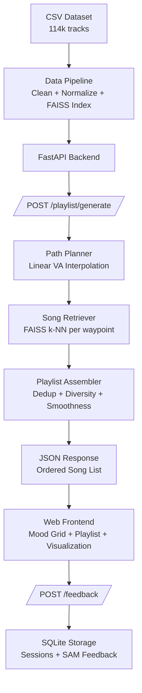

# AI-Powered Emotional Journey Playlists — MVP Implementation Plan

## Goal

Build the **Phase 0 + Phase 1 MVP** as described in [emotional_music_transition_system_analysis.md](file:///c:/Users/inbox/OneDrive/Desktop/ascend/emotional_music_transition_system_analysis.md). The goal is a functional web application where a user selects a **current mood** and a **target mood** from a 4×4 Valence-Arousal grid, and the system generates a smooth emotional-transition playlist using the 114k-track Spotify dataset.

> [!IMPORTANT]
> This plan implements **Approach 1** (Spotify features direct) for emotional embeddings and **Search-Based retrieval** for playlist generation — exactly as recommended for MVP in the study (Sections 8 & 9). No ML model training is required at this phase.

---

## Proposed Architecture Overview



---

## Proposed Changes

### Component 1 — Data Pipeline

> Processes the raw CSV into a cleaned, indexed format ready for fast retrieval.

#### [NEW] [data_pipeline.py](file:///c:/Users/inbox/OneDrive/Desktop/ascend/src/data_pipeline.py)

**Purpose**: One-time script to clean, normalize, and index the dataset.

**Steps**:
1. **Load & clean** `dataset.csv`:
   - Drop rows with missing `valence`, `energy`, `track_name`, or `artists`
   - Drop duplicate `track_id`s (keep highest popularity)
   - Drop tracks with `duration_ms < 30000` (under 30s — likely intros/interludes)
2. **Normalize VA coordinates**:
   - `V = valence` (already 0–1 in Spotify)
   - `A = energy` (already 0–1 in Spotify)
   - These map directly to the study's 2D emotional space **E ⊆ [0,1]²**
3. **Compute auxiliary features** for diversity/filtering:
   - `mood_quadrant`: Q1 (Happy: V>0.5, A>0.5), Q2 (Tense: V<0.5, A>0.5), Q3 (Sad: V<0.5, A<0.5), Q4 (Calm: V>0.5, A<0.5)
   - Normalize `tempo` to 0–1 range via min-max scaling
   - Normalize `loudness` to 0–1 range
4. **Build FAISS index**:
   - Create a `faiss.IndexFlatL2` on the 2D (V, A) vectors
   - Save the index to disk as `song_index.faiss`
   - Save the metadata DataFrame (track_id, track_name, artists, album_name, V, A, genre, tempo, danceability, etc.) as `song_metadata.parquet`
5. **Build the 16-mood grid** mapping:
   - 4×4 grid of labeled moods with (V, A) center coordinates
   - Based on Russell's Circumplex Model (Section 5.1 of the study)

**Mood Grid Definition** (from the study, Section 6.1):

| | Low Valence | Mid-Low V | Mid-High V | High Valence |
|---|---|---|---|---|
| **High Arousal** | Angry (0.15, 0.9) | Anxious (0.35, 0.85) | Excited (0.7, 0.9) | Euphoric (0.9, 0.95) |
| **Mid-High A** | Frustrated (0.2, 0.65) | Tense (0.35, 0.6) | Energized (0.7, 0.65) | Happy (0.85, 0.7) |
| **Mid-Low A** | Depressed (0.15, 0.35) | Melancholic (0.3, 0.4) | Content (0.7, 0.35) | Peaceful (0.85, 0.4) |
| **Low Arousal** | Drained (0.1, 0.15) | Sad (0.3, 0.2) | Relaxed (0.65, 0.2) | Calm (0.85, 0.15) |

> [!NOTE]
> The study explicitly recommends using `valence` and `energy` directly as (V, A) coordinates for MVP (Section 7.3: "For MVP: Yes, conditionally"). Acknowledged limitations: Spotify's valence is opaque and single-dimensional; energy conflates arousal and loudness. These are acceptable for MVP.

---

### Component 2 — Playlist Generation Engine

> Core algorithm: linear VA path interpolation → k-NN retrieval → deduplication + smoothness + diversity scoring.

#### [NEW] [playlist_engine.py](file:///c:/Users/inbox/OneDrive/Desktop/ascend/src/playlist_engine.py)

**Path Planning** (Section 6.1 of study):
- Input: `e_A = (v_start, a_start)`, `e_B = (v_target, a_target)`, `n_waypoints` (default 5)
- Generate N waypoints via linear interpolation:
  ```
  waypoint_i = e_A + (i / (N-1)) * (e_B - e_A)    for i in 0..N-1
  ```
- First waypoint = e_A (ISO Principle: start from current mood)
- Last waypoint = e_B (target mood)

**Song Retrieval** (per waypoint):
- FAISS k-NN search at each waypoint, k=10 candidates per waypoint
- Score each candidate on a **composite ranking**:
  ```
  score(s, waypoint_i) = w1 * va_proximity(s, waypoint_i)
                       + w2 * tempo_compatibility(s, waypoint_i)
                       + w3 * popularity_boost(s)
  ```
  - `va_proximity`: 1 - euclidean_distance(φ(s), waypoint_i), clamped to [0, 1]
  - `tempo_compatibility`: penalize large tempo jumps from previous selected song
  - `popularity_boost`: slight preference for well-known tracks (better UX)

**Playlist Assembly**:
- Select top 3 songs per waypoint → 15 songs total (within study's 15-20 song range)
- **Deduplication**: Remove duplicates across waypoints (same artist limit: max 2 songs per artist)
- **Smoothness check**: Verify `max_jump = max ||φ(s_{i+1}) - φ(s_i)|| < 0.3` (configurable threshold)
- **Diversity enforcement**: Genre entropy check — if a single genre exceeds 50% of the playlist, swap lower-ranked candidates from different genres
- Return ordered list with per-song emotional coordinates for visualization

**Automated Quality Metrics** (Section 10.1 of study):
- `endpoint_accuracy`: ||φ(s_n) - e_B||
- `smoothness_score`: mean ||φ(s_{i+1}) - φ(s_i)||
- `max_jump`: max ||φ(s_{i+1}) - φ(s_i)||
- `iso_compliance`: ||φ(s_1) - e_A|| < threshold
- `genre_entropy`: Shannon entropy of genre distribution
- These metrics are returned alongside the playlist for debugging and future evaluation

---

### Component 3 — Backend API (FastAPI)

#### [NEW] [main.py](file:///c:/Users/inbox/OneDrive/Desktop/ascend/src/main.py)

**Endpoints**:

| Method | Path | Description |
|--------|------|-------------|
| `GET` | `/api/moods` | Returns the 16-mood grid with labels and (V, A) coordinates |
| `POST` | `/api/playlist/generate` | Generates a transition playlist given `mood_start` and `mood_target` |
| `POST` | `/api/feedback` | Stores post-session SAM scale feedback |
| `GET` | `/api/playlist/{session_id}` | Retrieves a previously generated playlist |

**Request/Response schemas**:

```python
# Generate request
{
    "mood_start": "anxious",       # or custom (v, a) coordinates
    "mood_target": "calm",
    "n_songs": 15,                 # optional, default 15
    "genre_filter": ["pop", "acoustic"]  # optional
}

# Generate response
{
    "session_id": "uuid",
    "mood_start": {"label": "Anxious", "valence": 0.35, "arousal": 0.85},
    "mood_target": {"label": "Calm", "valence": 0.85, "arousal": 0.15},
    "waypoints": [...],            # interpolated path coordinates
    "playlist": [
        {
            "position": 1,
            "track_id": "...",
            "track_name": "...",
            "artists": "...",
            "album_name": "...",
            "valence": 0.34,
            "arousal": 0.82,
            "genre": "indie",
            "waypoint_index": 0
        },
        ...
    ],
    "metrics": {
        "endpoint_accuracy": 0.05,
        "smoothness_score": 0.08,
        "max_jump": 0.12,
        "iso_compliance": true,
        "genre_entropy": 2.1
    }
}

# Feedback request (SAM scale, per study Section 10.2)
{
    "session_id": "uuid",
    "pre_valence": 3,    # 1-9 SAM scale
    "pre_arousal": 7,
    "post_valence": 7,
    "post_arousal": 3,
    "completed": true,
    "skipped_tracks": [2, 5]
}
```

#### [NEW] [database.py](file:///c:/Users/inbox/OneDrive/Desktop/ascend/src/database.py)

- SQLite for MVP (study recommends PostgreSQL for production, SQLite is fine for MVP)
- Tables: `sessions` (id, mood_start, mood_target, playlist_json, created_at), `feedback` (session_id, pre/post SAM scores, completion, skips)

---

### Component 4 — Web Frontend

> A premium, interactive single-page application with mood grid selection, animated VA-space path visualization, and playlist display.

#### [NEW] [index.html](file:///c:/Users/inbox/OneDrive/Desktop/ascend/frontend/index.html)

**Three-panel layout with animated transitions between stages**:

1. **Mood Selection Stage** — "How are you feeling? → Where do you want to be?"
   - Interactive 4×4 mood grid rendered as a styled matrix of cards
   - Each card: mood label + emoji + subtle gradient matching the emotional quadrant
   - Two-step selection: first select "current mood" (card highlights with glow), then "target mood"
   - Animated connecting line between the two selections previewing the emotional journey
   - "Generate Journey" CTA button

2. **Playlist & Visualization Stage** — The emotional journey
   - **Left panel**: 2D VA scatter plot (Canvas/SVG) showing:
     - All waypoints on the interpolated path (connected by a smooth gradient line)
     - Each song plotted as a dot at its (V, A) coordinates
     - Currently playing song highlighted with pulse animation
     - Mood quadrant labels and subtle quadrant coloring
   - **Right panel**: Playlist tracklist
     - Song cards with track name, artist, album
     - Waypoint grouping (visual separator between emotional stages)
     - Progress indicator showing which emotional stage the listener is in
     - Click-to-play functionality (in-browser audio if available, otherwise Spotify link)

3. **Feedback Stage** — Post-session SAM scale
   - Two simple 9-point visual scales (SAM manikins or emoji-based)
   - "How do you feel now?" (Valence) + "How energized do you feel?" (Arousal)
   - Completion check and skip reporting
   - Thank you + summary card showing the emotional distance traveled

#### [NEW] [styles.css](file:///c:/Users/inbox/OneDrive/Desktop/ascend/frontend/styles.css)

**Design system**:
- Dark mode primary (deep navy/charcoal background)
- Gradient accents mapped to emotional quadrants:
  - Q1 (Happy/High energy): warm gold → coral gradient
  - Q2 (Tense/Angry): deep red → crimson gradient
  - Q3 (Sad/Low energy): deep blue → indigo gradient
  - Q4 (Calm/Relaxed): teal → soft green gradient
- Glassmorphism cards with backdrop blur
- Smooth CSS transitions and keyframe animations for stage changes
- Inter/Outfit font from Google Fonts
- Responsive layout (mobile-friendly mood grid)

#### [NEW] [app.js](file:///c:/Users/inbox/OneDrive/Desktop/ascend/frontend/app.js)

- State machine managing 3 stages: `SELECT_MOOD → PLAYLIST → FEEDBACK`
- Canvas-based 2D emotional space visualization
- API calls to FastAPI backend
- Local audio playback via `<audio>` element (if direct audio URLs available) or Spotify external links
- SAM scale interactive component

---

## Project Structure

```
ascend/
├── dataset.csv                    # Raw dataset (existing)
├── emotional_music_transition_system_analysis.md  # Study (existing)
├── src/
│   ├── __init__.py
│   ├── data_pipeline.py           # Data cleaning, normalization, FAISS indexing
│   ├── playlist_engine.py         # Path planning + song retrieval + assembly
│   ├── main.py                    # FastAPI application
│   ├── database.py                # SQLite session/feedback storage
│   ├── models.py                  # Pydantic request/response schemas
│   └── mood_grid.py               # 16-mood grid definition and VA mappings
├── data/                          # Generated artifacts from data pipeline
│   ├── song_index.faiss
│   ├── song_metadata.parquet
│   └── pipeline_report.json       # Stats from data cleaning
├── frontend/
│   ├── index.html
│   ├── styles.css
│   └── app.js
└── requirements.txt               # Python dependencies
```

---

## Open Questions

> [!IMPORTANT]
> **Audio Playback**: The dataset contains Spotify `track_id`s but no direct audio URLs. For MVP playback, should we:
> - **Option A**: Link out to Spotify (opens in Spotify app/web player) — simplest, no API key needed
> - **Option B**: Use Spotify Web Playback SDK (requires Spotify Premium + API credentials from the user)
> - **Option C**: Use Spotify 30-second preview URLs (available via Spotify API, needs a free developer key)
> 
> I recommend **Option A** for initial build, with Option C as a fast follow-up if you have a Spotify developer account.

> [!IMPORTANT]
> **Genre Filtering**: The dataset has 114k tracks across many genres. Should the mood grid allow optional genre filtering (e.g., "I want to go from Anxious → Calm, but only with acoustic/indie music")? This is easy to implement but affects playlist diversity.

> [!NOTE]
> **Mental Health Safety (Study Section 11.3)**: The study strongly recommends implementing a "mood floor" — declining to run if the user's self-reported mood is at the extreme low end of the valence scale. For MVP, I will add a gentle disclaimer + mental health resource link, but not a hard block. We can discuss the right threshold for V2.

---

## Verification Plan

### Automated Tests
- `python -m pytest tests/` — unit tests for:
  - Data pipeline: correct number of rows after cleaning, VA range [0,1]
  - Path planner: correct waypoint count, start/end match
  - Song retrieval: dedup works, diversity thresholds met
  - Quality metrics: all computed correctly
- `python src/data_pipeline.py` — validate pipeline runs without errors, check output stats

### Manual Verification
- Run the full app locally (`uvicorn src.main:app` + open `frontend/index.html`)
- Select several mood pairs (Anxious→Calm, Sad→Happy, Angry→Peaceful) and verify:
  - Playlists feel emotionally coherent
  - VA scatter plot shows a smooth path
  - No duplicate artists dominating the list
  - Endpoint songs are near the target mood
- Submit SAM feedback and verify it's stored in SQLite

### Quality Metrics Validation
- For 10 sample mood transitions, verify:
  - `endpoint_accuracy < 0.15` (last song within 0.15 of target in VA space)
  - `smoothness_score < 0.15` (average step size is small)
  - `max_jump < 0.3` (no jarring transitions)
  - `iso_compliance = true` (first song near starting mood)
  - `genre_entropy > 1.5` (reasonable genre diversity)

---

## Dependencies

```
fastapi>=0.100.0
uvicorn>=0.23.0
pandas>=2.0.0
numpy>=1.24.0
faiss-cpu>=1.7.4
pyarrow>=12.0.0      # for parquet
pydantic>=2.0.0
aiosqlite>=0.19.0    # async SQLite
```
